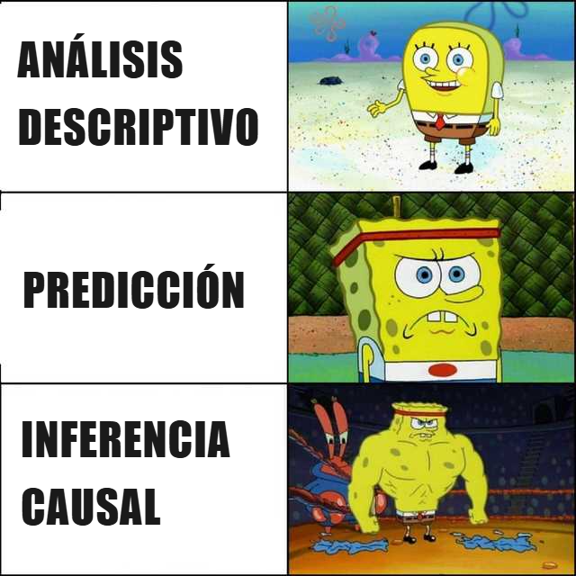

# Decidir título definitivo {#cap-proceso-econometrico}

*pensar qué titulo le doy a esta seción introductoria*

Alternativas:

1.  Preguntas, datos y modelos (no me acaba de convencer)

2.  Introducción a la econometría (muy similar al título de la parte y ya he usado "Introducción antes")

3.  Marco conceptual (igual que en la parte de causal inference y creo que prefiero no repetir)

*quizás si renombro el primer capítulo de la sección de causal inference a "potential outcomes" o algo así, uso aquí "Marco conceptual"*

## Estructura

1.  Intro (sin header)

2.  Todo empieza con una pregunta

3.  Cuál es tu objetivo: Descriptivo vs. Predicción vs. inferencia causal.

4.  El proceso econométrico / la hoja de ruta

5.  Especificación

6.  estimación

7.  inferencia

------------------------------------------------------------------------

Antes de ponerte a hacer tests Shapiro-Wilk para comprobar si tus datos siguen una distribución normal o correr regresiones como si no hubiera un mañana, merece la pena detenernos a entender por qué usamos estas técnicas en primer lugar.

En esta segunda parte del libro explico los conceptos y herramientas esenciales para poder llevar a cabo estudios econométricos. Todos parten de 2 ingredientes fundamentales:

-   Una **pregunta** de investigación

-   **Datos** para poder responderla

Los datos son imprescindibles porque sin ellos no hay análisis cuantitativo posible. 
Sin embargo, es principalmente el tipo de pregunta lo que determina la hoja de ruta general — si buscamos describir, predecir o identificar una relación causal. 
Los datos condicionan sobre todo las decisiones técnicas posteriores: qué modelo especificamos y qué técnica de estimación usamos.

## Todo empieza con una pregunta {#sec-todo-empieza-con-una-pregunta}

Un buen proyecto de investigación empieza con una pregunta bien formulada. Por "bien formulada" me refiero a una preguna *concreta* que se pueda atacar con datos.

Veamos algunos ejemplos:

-   ¿Cómo ha sido la evolución de la duración de procesos de incapacidad temporal en España en los últimos 10 años? ¿cómo varían en función del sexo, grupo de edad, comunidad autónoma, enfermedad causante de la incapacidad y régimen de la persona trabajadora?

-   ¿Qué caracteristicas de una persona se correlacionan con la probabilidad de tener un episodio de incapacidad temporal?

-   ¿Cuál es la duración más probable para un nuevo proceso de un trabajador de entre 25 y 35 años de Castilla-La Mancha adscrito al Régimen General de la Seguridad Social, que empieza un proceso de incapacidad temporal por un esguince de tobillo?

-   ¿Cuál es el impacto que ha tenido el Real Decreto 956/2018, que incrementa el complemento retributivo al 100% desde el primer día de baja para los funcionarios, en la probabilidad de que estos empiecen un proceso de incapacidad temporal?

@Angrist-Prischke-2009 recomiendan pensar en cómo diseñaríamos un experimento ideal que nos ayudaría a responder a nuestra pregunta. 
Por ejemplo, para medir el impacto que ha tenido la aprobación del Real Decreto 956/2018 en la probabilidad que los funcionarios inicien un episodio de incapacidad temporal (IT), podríamos añadir una cláusula que aplicara la mejora del complemento salarial sólo a la mitad de los funcionarios: por ejemplo, sólo a aquellos nacidos en un día par.\[\^20-nota-1\] 
De este modo, podríamos comparar la probabilidad de iniciar un episodio de IT entre los que tuvieron la suerte de recibir la prestación por incapacidad temporal del 100% de su base de cotización y los que no, manteniendo el resto de variables constantes.

\[\^20-nota-1\]: Implícitamente, asumo que no existe correlación entre el día del mes en el que nace un funcionario (más concretamente, si este es par o impar) y su probabilidad de empezar un proceso de incapacidad temporal, lo que parece bastante razonable.

Evidentemente, no todos los experimentos son factibles ni deseables desde un punto de vista ético, pero el mero hecho de pensarlo nos ayuda a explicitar qué factores nos gustaría manipular y cuáles queremos mantener constantes.

Sin embargo, su marco conceptual se aplica exclusivamente a preguntas que busquen identificar relaciones causales, que yo desarrollo en la tercera parte de este libro. 
Pero de los cuatro ejemplos que he expuesto, sólo la pregunta sobre el Real Decreto trata de identificar una relación causal; las otras tres buscan resumir los datos mediante estadísticos descriptivos o predecir valores desconocidos a partir de los datos disponibles.

Por tanto, antes de continuar, merece la pena definir qué distingue estas clases de preguntas y qué implicaciones tiene para el análisis.

### ¿Cuál es tu objetivo? {#sec-cual-es-tu-objetivo} 

@Hernán-et-al-2019 proponen una clasificación con **tres categorías en función del objetivo que perseguimos**: describir, predecir o identificar impactos causales. 
En mi opinión, esta distinción se puede ilustrar fácilmente con una imagen.

```{r}
#| label: fig-meme-bob-esponja
#| echo: false
#| fig-cap: |
#|   Meme comparando la exigencia metodológica de cada clase de investigación en 
#|   función de su objetivo (elaboración propia a partir de una plantilla de ImageResizer).
#| fig-alt: |
#|   La figura muestra un meme con tres imágenes de Bob Esponja, cada una más fuerte y
#|   musculado que la anterior, con tres textos: "análisis descriptivo", "predicción" e
#|   "inferencia causal", respectivamente.  


```

Bromas aparte, a lo largo de esta sección entenderéis por qué la inferencia causal se lleva la versión musculada de Bob Esponja. 
Pero la importancia de distinguir entre estos tres objetivos va más allá de su exigencia metodológica: cada uno marca una hoja de ruta distinta, y confundirlos es una fuente habitual de errores en la práctica.

La @tbl-preguntas-objetivos concreta en qué consiste cada objetivo y muestra cómo suelen ser las preguntas de cada clase. 
Esta clasificación no implica que un estudio deba encapsularse en una única categoría. 
Por ejemplo, es muy común que una investigación incorpore elementos descriptivos antes de pasar a la predicción y/o la inferencia causal. 
Se trata, sin embargo, de un marco conceptual útil para entender qué hacemos en cada fase del análisis.

| Objetivo | En qué consiste | Tipo de pregunta | Ejemplo de pregunta |
|------------------|------------------|------------------|------------------|
| Descripción | Resumir de forma quantitativa características del mundo y explorar relaciones entre variables | ¿Qué está pasando? | ¿Cómo ha sido la evolución de la duración de procesos de incapacidad temporal en España en los últimos 10 años? |
| Predicción | Estimar un valor desconocido a partir de datos disponibles | ¿Qué valor esperamos para un nuevo caso? | ¿Cuál es la duración más probable para un nuevo proceso de incapacidad temporal? |
| Inferencia causal o contrafactual | Estimar el impacto causal de una variable sobre otra | ¿Qué pasaría si intervenimos? | ¿Cuál es el impacto de incrementar el complemento retributivo de la prestación por incapacidad temporal (IT) en la probabilidad de empezar un proceso de IT? |

: Clases de preguntas según el objetivo de investiación {#tbl-preguntas-objetivos}

### El papel del análisis descriptivo

Los trabajos descriptivos suelen quedar en un segundo plano, pero constituyen un primer paso fundamental en cualquier análisis (a veces esta fase se llama "exploratoria"). 
Antes de aplicar técnicas más complejas, es esencial conocer bien los datos con los que trabajamos. 
Entender su estructura nos permite detectar anomalías y formarnos una intuición sobre las relaciones que pueden existir entre las variables.

De hecho, en caso de contar con una base de datos rica, la parte descriptiva puede tomar un papel protagonista. 
Por ejemplo, durante mi estancia como becario en la Autoridad Independiente de Responsabilidad Fiscal (AIReF) participé en un [estudio](https://www.airef.es/es/estudios/incapacidad-temporal/) sobre la incapacidad temporal (IT) en España en el que dispusimos, entre otras, de una base de datos de los cerca de 70 millones de episodios sucedidos entre 2017 y 2024 (es decir, la población entera de episodios de IT en España para ese periodo). 
El estudio incorpora hasta tres ejercicios contrafactuales, pero el peso del análisis recae en la parte descriptiva, donde se analiza en profundidad la evolución de la incidencia y duración de los procesos de IT, así como los factores determinantes de la incapacidad temporal.

Las técnicas empleadas abarcan desde simples cálculos de medias o percentiles de una distribución (en la @sec-analisis-exploratorio explico cómo hacerlo con R) hasta regresiones logísticas para entender qué características de las observaciones se asocian con la variable dependiente, o algoritmos no supervisados como el análisis de clústeres. 
Esta información la podemos comunicar con cifras, aunque en la mayoría de los casos los gráficos constituyen un soporte visual con mayor poder comunicativo.

La frontera entre la fase descriptiva y las otras a veces son algo difusas. 
Por ejemplo, cuando queremos predecir un resultado (*outcome*) sobre una variable $y$, empezamos estimando un modelo con los datos disponibles $y = f(X)$, que luego usamos para realizar predicciones $\hat{y}$. 
@Hernán-et-al-2019 incluyen todo el proceso dentro del saco de la predicción, aunque en mi opinión, hasta que no usamos el modelo para realizar predicciones, estamos llevando a cabo un análisis descriptivo, en concreto, identificando qué valores de $X$ se correlacionan con diferentes valores de $y$.

### Predicción vs inferencia causal

A diferencia de las tareas descriptivas, la predicción y las metodologías contrafactuales exigen ir más allá de lo directamente observable en los datos. 
Sin embargo, la distinción entre ambas es quizás aún más relevante puesto que conducen a caminos metodológicos completamente distintos.

Los trabajos de predicción son muy relevantes en áreas como finanzas o macroeconomía, por no decir vitales en áreas ajenas a la economía como la medicina. 
Si entrenamos un modelo de *machine learning* con miles de imágenes de ecografías etiquetadas por radiólogos expertos, el modelo aprende a identificar patrones visuales asociados a tumores malignos, con el potencial de mejorar el diagnóstico temprano en entornos con acceso limitado a radiólogos o escalar el número de personas a las que hacer cribajes.

En estos casos, estamos interesados en mapear unos *inputs* con unos *outputs* (por ejemplo, imágenes con diagnósticos), sin prestar demasiada atención a los mecanismos que conectan unos con otros. 
En otras palabras, nos interesa la correlación, no la causalidad.

Otro ejemplo en el campo de las finanzas ilustra precisamente este punto. 
Podemos entrenar un modelo de procesamiento de lenguaje natural con miles de noticias financieras para predecir movimientos en el precio de las acciones — no porque entendamos por qué ciertas palabras predicen ciertos movimientos, sino porque el patrón existe en los datos y se generaliza a casos nuevos.

El objetivo siempre es **maximizar la capacidad predictiva** del modelo fuera del conjunto de datos que disponemos, ya que queremos aplicarlo para nuevos casos o escenarios futuros. 
Un modelo es mejor que otro si obtiene mejor puntuación en las métricas que determinan su capacidad predictiva.

En el @cap-modelo-regresion explico cómo podemos realizar predicciones a partir de un modelo de regresión en R, aunque en este campo la regresión es una alternativa más dentro de un ecosistema amplio de técnicas.
Con el auge del *big data*, modelos como los bosques aleatorios o las redes neuronales suelen superar a la regresión clásica en capacidad predictiva, especialmente cuando la relación entre variables es compleja y no lineal. 
La cuarta parte del libro introduce las principales técnicas de *machine learning* aplicadas a la predicción.

En cambio, en los ejercicios contrafactuales no nos vale con detectar correlaciones, sino que el objetivo es **identificar relaciones causales**.
Detectar que dos variables se mueven juntas no nos dice si una causa a la otra, o si ambas responden a un tercer factor. 
Para ello, debemos plantearnos qué habría pasado si el curso de acción hubiera sido diferente, es decir, plantear un escenario *contrafactual*, esto es, un escenario alternativo al que efectivamente ocurrió.
Pero nunca observamos a la misma persona o entidad realizando dos cosas distintas, lo que se conoce como el **problema fundamental de la causalidad**. 

Este es un ejercicio fundamental en el área de las políticas públicas, porque permite identificar qué políticas son efectivas y cuales no tienen impacto real en el objetivo que perseguían.
*tomar uno de los apuntes de Mar-Jacint o de MHE o Stock and Watson*
Por ejemplo, para comprobar el impacto que tiene en el consumo de electricidad instalar un contador...

Si tenemos la suerte de poder llevar a cabo un diseño experimental, aislar el impacto causal será una tarea relativamente sencilla. 
Sin embargo, su implementación es logísticamente compleja y costosa: hay que garantizar que los participantes sigan su rol asignado, minimizar el abandono del experimento y, en muchos casos, esperar años hasta obtener resultados.

Por tanto, en la mayoría de los casos tratamos de identificar efectos causales en contextos no experimentales. 
Y es aquí donde recae la complejidad metodológica que transmite el meme. 
Tendremos que ser muy creativos para encontrar situaciones en las que los datos observacionales se aproximan a condiciones experimentales.
Y muy meticulosos para justificar cada decisión metodológica, especialmente respecto a las posibles fuentes de endogeneidad.
La tercera parte de este libro se dedica a las principales técnicas en econometría causal, como el uso de variables instrumentales, estimadores de diferencia en diferencias y diseños de regresión en discontinuidad.

En inferencia causal, a diferencia de la predicción, la regresión no es una alternativa más sino el vehículo principal, ya que combina la flexibilidad necesaria para implementar distintas estrategias de identificación con la interpretabilidad de sus coeficientes, que es precisamente lo que nos interesa cuando buscamos cuantificar un efecto causal. 
Por este motivo, el @cap-modelo-regresion profundiza en cada uno de sus elementos.

## Datos

### Población y muestra

El segundo ingrediente imprescindible en todo estudio cuantitativo son los datos, la materia prima a partir de la cual extraemos conclusiones. Pero datos sobre qué, exactamente — esa es la primera pregunta que debemos responder, y nos lleva al concepto de **población objetivo**.

Según la [definición](https://www.ine.es/dyngs/COL/index.htm?cid=453) del Instituto Nacional de Estadística (INE), la población es el "conjunto de unidades del que se desea obtener cierta información". 
Las unidades pueden ser personas, empresas, países, o cualquier entidad que se adecue a la realidad económica que queremos medir.
Lo importante es establecer claramente cuál es la **unidad de investigación** y delimitar el ámbito geográfico y temporal al que se restringe la población a investigar, es decir, los criterios que permiten diferenciar si una entidad forma parte o no de la población objetivo.

Fíjate que la población objetivo depende de la pregunta de investigación, y que un mismo estudio con diversas preguntas de investigación puede incluir definiciones de población diferentes. 
Tomemos como ejemplo las preguntas que enumero en la @sec-todo-empieza-con-una-pregunta. A pesar de que todas ellas se enmarcan en el [estudio](https://www.airef.es/es/estudios/incapacidad-temporal/) de la AIReF sobre la incapacidad temporal (IT) en España, la población objetivo cambia:  

| Pregunta | Población objetivo |
|----|----|
| ¿Cómo ha sido la evolución de la duración de procesos de incapacidad temporal en España en los últimos 10 años? | Todos los trabajadores que han tenido un proceso de incapacidad temporal en España en los últimos 10 años. |
| ¿Qué características se correlacionan con la duración o frecuencia de los episodios de incapacidad temporal? | Todos los trabajadores que han tenido un proceso de incapacidad temporal en España en los últimos 10 años.\[\^20-nota-2\] |
| ¿Cuál es la duración más probable para un nuevo proceso de un trabajador con unas características concretas? | Todos los trabajadores en activo. |
| ¿Cuál es el impacto que ha tenido el Real Decreto 956/2018 en la probabilidad de que estos empiecen un proceso de incapacidad temporal? | Los funcionarios en activo. |

\[\^20-nota-2\]: Si la pregunta se reformula como "¿qué características se correlacionan con la *probabilidad* de tener un episodio?", la población objetivo pasa a ser todos los trabajadores activos, ya que los trabajadores sin episodios son parte relevante de la distribución de interés.

El objetivo de todo estudio es extraer conclusiones sobre la **población objetivo**. 
Hay veces que contaremos con toda la población, como en el caso de la parte descriptiva del estudio de la AIReF. 
Estos estudios se conocen en estadística como "estudios de censo", y en estos casos no hay incertidumbre sobre los estadísticos que calculamos porque no estamos generalizando a partir de una muestra. 
Sin embargo, tanto la inferencia causal como la predicción implican un tipo de incertidumbre distinta — no sobre la muestra, sino sobre lo que no observamos: el contrafactual o los casos futuros, respectivamente — que no desaparece aunque dispongamos de datos censales. 

Pero lo más frecuente es que trabajemos sólo con un subconjunto de la población objetivo, es decir, con una **muestra**. 
Para que las estimaciones que obtenemos de la muestra tengan validez, debemos asegurarnos que esta sea representativa, es decir, que el proceso de muestreo no introduzca sesgos.
A continuación, describo los conceptos esenciales e identifico las principales fuentes de sesgo que debemos evitar.\[\^20-nota-3\] 

\[\^20-nota-3\]: Las técnicas de muestreo y diseño de encuestas podrían dar para un capítulo entero, pero puesto que el foco de este libro es en la econometría, redirigo al lector interesado en ello a [!!introducir recurso!!]

En primer lugar, la muestra no la extraemos directamente de la población, sino del **marco muestral**, es decir, del listado o registro concreto a partir del cual podemos seleccionar la muestra. 
Idealmente, el marco muestral debería de coincidir con la muestra, pero a menudo este no es el caso.
Por ejemplo, si queremos estudiar a los trabajadores en activo en España (población objetivo), el marco muestral podría ser el registro de afiliados a la Seguridad Social. 
Pero ese registro excluye a trabajadores en economía sumergida, que forman parte de la población objetivo pero no del marco muestral.
La diferencia entre población objetivo y marco muestral es una fuente de sesgo que se llama error de cobertura. 
Esto puede darse tanto cuando hay unidades en la población objetivo que no están en el marco muestral, como cuando hay unidades en el marco que no deberían estar en la población. 
Por ejemplo, puede que el registro no esté actualizado y aparezcan personas que realmente ya no están en activo.

En segundo lugar, el método de muestreo debe garantizar la representatividad de la muestra.

...

La forma como obtenemos, o se ha obtenido dicha muestra es relevante 

*Muestreo*

- Muestra y representatividad: qué hace que una muestra sea válida para extraer conclusiones sobre la población
- Sesgo de selección muestral: como problema que surge cuando la muestra no representa bien la población


(aunque, según la disponibilidad, quizás debemos reformular la pregunta...)

-   cuestiones a tener en cuenta al realizar un muestreo

    -   muestra aleatoria y sesgos...

    -   ejemplo: si haces una encuesta sobre ... a los compañeros de tu universidad, vas a sacar conclusiones sobre los estudiantes universitarios, no sobre "los jóvenes"...

----------

### Clases de datos

-   tipos de datos

    -   por naturaleza: sección cruzada, panel, serie temporal

    -   por proceso generador: observacional vs experimental

----------

*añadir estas dos secciónes, que sólo aplican a modelos de regresión paramétricos, no?*

**Sección 5 — La estimación** Breve. La pregunta que responde es: dado el modelo especificado, ¿cómo obtenemos los valores de los parámetros a partir de los datos? Mencionas que existen distintos métodos (OLS, MLE, GMM) con distintas propiedades y supuestos, y que la elección no es trivial. Dos o tres párrafos.

**Sección 6 — La inferencia** Breve también. La pregunta que responde es: ¿cuánta confianza podemos depositar en nuestras estimaciones? Tests, intervalos de confianza, p-values como herramientas para responderla. Dos o tres párrafos.


## La hoja de ruta

Tal y como he explicado en la @sec-cual-es-tu-objetivo, el tipo de pregunta de investigación determina el curso de acción. 
El remanente de este capítulo y del resto de esta parte del libro está enfocado a 

insertar esquema / flujo con el marco conceptual que acabo de describir, que sirve como link con el resto de esta parte del libro.

----------

debemos definir un **modelo**, es decir, cómo representamos de forma simplificada un proceso económico, en base a una serie de supuestos sobre qué variables importan, cómo se relacionan, y qué queda fuera.

En econometría, la regresión es el vehículo principal para especificar modelos, motivo por el que merece un capítulo propio. Pero definir el modelo es solo el punto de partida: una vez especificado, necesitamos **estimar** sus parámetros, es decir, obtener valores concretos a partir de los datos. Y una vez estimados, necesitamos saber cuánta confianza podemos depositar en ellos, que es exactamente lo que nos permite la **inferencia** estadística.\[\^20-nota-1\]

\[\^20-nota-1\]: El marco conceptual de modelo, estimación e inferencia describe el flujo típico de la econometría aplicada, pero existen excepciones. Los modelos no paramétricos, comunes en *machine learning*, no asumen ninguna forma funcional para describir la relación entre las variables de interés. Y hay contextos, como los modelos de simulación o la predicción pura, donde la inferencia estadística clásica puede quedar fuera del proceso.

La @fig-diagrama-proceso-econometrico representa de forma simplificada "el proceso econométrico". En la práctica, sin embargo, el proceso es iterativo y la especificación del modelo se revisa y ajusta a medida que avanza el análisis.\[\^20-nota-2\]

\[\^20-nota-2\]: Este diagrama está especialmente pensado para preguntas de inferencia causal, aunque también aplica para preguntas descriptivas que impliquen técnicas econométricas, como las regresiones con variable dependiente limitada. Otras preguntas descriptivas aplican directamente estadísticos sobre la muestra, aplicando ponderacones si es necesario. Por último, en las preguntas predictivas por lo general,

```{r}
#| label: fig-diagrama-proceso-econometrico
#| echo: false
#| out-width: "80%" 
#| fig-cap: |
#|   Diagrama del proceso econométrico (elaboración propia).
#| fig-alt: | 
#|   Diagrama que muestra las etapas del proceso econométrico. 
#|   Partimos de una pregunta de investigación (puede clasificarse en una de las 
#|   siguientes clases: descriptiva, predictiva, contrafactual) y unos datos, que 
#|   a menudo son una muestra de la población de interés. A partir de aquí definimos
#|   el modelo que representa la relación entre variables de interés, que generalizo
#|   como y = f(X). Luego usamos una tecnica de estimación para obtener los 
#|   parámetros que mejor describen los datos. Finalmente, realizamos inferencia
#|   para conocer el nivel de certeza que tenemos con nuestros resultados.

knitr::include_graphics("figura/diagrama-proceso-econometrico.svg")
```


### El proceso econométrico / La hoja de ruta

*quizás mejor volver a la narrativa de "ejes fundamentales" si quiero evitar la lógica secuencial, aunque en mi opinión esa funciona bien*

-   una

-   el objetivo siempre es **estimar algún parámetro**, que en la mayoría de los casos son "medias"

-   queremos capturar la esencia, no el ruido. parte del error es fundamental en la randomness de la realidad

*mucho mejor revisar el contenido con Mostly Harmless Econometrics*

\[*insertar flujo creado por mi*\]

### **Identificación**

cómo vamos a asegurarnos que aquello que estimamos puede tener una identificación causal. Responde a: ¿cómo voy a aislar el efecto que me interesa?

-   credibility revolution
-   correlación vs causalidad
-   **El problema fundamental de la inferencia causal** (el contrafactual no observable), que es la razón por la que necesitamos una estrategia de identificación en primer lugar.
-   marco conceptual y técnicas principales merecen un capítulo entero
-   clases de datos

Problemas de identificación → ¿el objeto poblacional tiene la interpretación causal que quiero? ¿Estoy midiendo lo que creo que mido? Esto es pura teoría, no tiene nada que ver con el tamaño muestral. Problemas de estimación e inferencia → dado que sé lo que quiero medir, ¿cómo lo estimo bien con datos finitos? ¿Cuánta incertidumbre tengo?

SOBRE EL ORDEN IDENTIFICACIÓN \<-\> ESPECIFICACIÓN

Una solución híbrida: presentas los pasos en orden 1, pero incluyes una nota explícita diciendo que identificación y especificación se retroalimentan, y que el orden refleja prioridad lógica, no secuencia mecánica.

### **Especificación**

## **Especificar el modelo**

exploramos una relación económica.

La definimos con un modelo: y = F(X)

Clasificaciones principales de los modelos:

f(X) puede tomar muchas formas, ejemplo del TFM, una red neuronal para no paramétrico, un modelo DSGE para estructural

**1. Paramétrico vs. no paramétrico** La más fundamental. ¿Asumes que f(X) tiene una forma funcional con un número finito de parámetros, o dejas que los datos determinen la forma libremente? Esta distinción existe antes de hablar de regresión — tu ejemplo del TFM es paramétrico aunque no sea una regresión.

**2. Causal vs. predictivo** Ya lo has establecido en la sección 2, pero vale la pena recordarlo aquí porque afecta directamente a qué exiges del modelo. En un modelo causal, los parámetros tienen que tener interpretación estructural. En uno predictivo, solo te importa que f(X) aproxime bien E\[Y\|X\].

**3. Estructural vs. de forma reducida** Esta es más sutil pero importante. Un modelo estructural parte de la teoría económica y especifica mecanismos (tu TFM es un ejemplo). Un modelo de forma reducida describe relaciones estadísticas entre variables observables sin modelizar el mecanismo. La regresión suele ser de forma reducida.

regresión: un modelo paramétrico, generalmente de forma reducida, que puede ser lineal o no lineal.

En econometría, la regresión como forma canónica E\[Y\|X\].

Regresión como vehículo; Flexibilidad, interpretabilidad.

Anticipa el capítulo de especificación (el modelo de regresión es sólo una posibilidad dentrod el mundo de "modelización", pero es un mundo en si mismo que merece investigar con detalle).

---

-   Es **estructural / estadística**, y responde a: ¿cómo creo que funciona el mundo?

    -   modelos lineales vs no lineales

        -   un modelo lineal es lineal en los parámetros (no necesariamente en las variables), y eso tiene implicaciones enormes en cómo se estima y cómo se interpreta. Ahí también puedes justificar por qué los modelos lineales ocupan tanto espacio en el libro: no porque sean siempre los más precisos, sino porque son aproximaciones sorprendentemente buenas en muchos contextos y tienen propiedades analíticas que los hacen tractables.

    -   incluir polinomios u otras transformaciones

    -   Dinámica temporal, dependencia, heterogeneidad.

    -   Distribuciones del error, reglas de decisión, restricciones económicas.

    -   Closed-form solutions vs no (quizás en fundamentos matemáticos)

-   La distribución no es relevante: en econometría casi nunca partimos de una población normal (e.g. estudio de salarios, otros).

-   La especificación incluye decisiones sobre **qué variables entran en el modelo**, que es donde aparece el riesgo de sesgo por variable omitida. Eso crea un puente natural hacia identificación sin confundir los dos ejes.

-   tests de validacion

    -   Preguntas del tipo: ¿está el modelo bien especificado? No preguntan sobre el valor de los parámetros sino sobre si el modelo en sí es adecuado. Ejemplos típicos son el test de Ramsey (RESET) para forma funcional, el test de Breusch-Pagan o White para heterocedasticidad, el test de Hausman para endogeneidad, o los tests de raíz unitaria en series temporales.

### **Técnica de estimación**

-   3 metodologías generales (sólo introducción con la intuición):

    -   **MCO**: minimiza suma de cuadrados. Requiere muy pocos supuestos pero es el menos flexible.
    -   **MV/ML**: maximiza la verosimilitud. Requiere especificar completamente la distribución de Y, lo cual es más supuestos pero produce estimadores eficientes si la distribución está bien especificada.
        -   Técnicamente es la distribución del **error**, no de Y directamente, aunque en la práctica es equivalente dado X. Vale la pena ser preciso aquí precisamente porque es la confusión que queremos desactivar desde el principio.
    -   **GMM**: impone solo que ciertas condiciones de momentos sean cero en la población, E\[g(y,θ)\] = 0. No requiere especificar ninguna distribución completa. MCO y MV son casos especiales de GMM con condiciones de momentos particulares.
    -   Sería interesante que, cuando desarrolle más cómo funcionan, explique un poco "qué hay detrás de los commandos que corremos" (closed-form solutions, algoritmos, etc.) es decir, tratar de acercar el concepto a "si lo hicieras a mano, ¿cómo sería?"
    -   la elección de técnica no es independiente de la especificación ni de los supuestos, lo cual es un punto pedagógico importante. OLS es BLUE bajo ciertos supuestos, si los supuestos cambian, cambia el estimador óptimo.

#### Sobre técnicas de estimación que podrías dejar fuera

OLS, MLE y GMM cubren el 95% de lo que un econometrista aplicado usa. Lo que dejas fuera relevante:

**Econometría bayesiana:** sí merece una mención, aunque sea breve. El argumento para mencionarla es que representa una filosofía distinta sobre qué significa "estimar" — no buscas el valor del parámetro que maximiza algo dado los datos, sino que actualizas una distribución de creencias. Es una diferencia conceptual importante, no solo técnica. Puedes dedicarle dos párrafos diciendo "existe esta otra tradición, aquí está la intuición, no la desarrollamos porque requeriría otro libro".

**Modelos estructurales:** aquí soy más ambivalente. En economía industrial y macroeconomía son centrales, pero implican una filosofía completamente distinta — especificas un modelo económico con sus parámetros estructurales y luego lo estimas. La frontera con "lo que cubre tu libro" es bastante clara, así que con una mención breve en el capítulo introductorio es suficiente.

**Lo que sí añadiría a tu lista principal:** estimación no paramétrica y semiparamétrica. No como un método de estimación separado al nivel de GMM, sino como una familia que aparece de forma natural en RDD (local linear regression) y en ML. Podrías mencionarla en el capítulo de estimación como "existe una tercera vía que no asume forma funcional paramétrica" sin desarrollarla completamente.

### **Inferencia**

-   es **probabilistica**, dados nuestros datos y los parámetros que hemos estimado, *qué sabes sobre la precisión de lo estimado*

-   La inferencia **no “arregla” el estimador**, solo cuantifica el nivel de incertidumbre *dado* el estimador.

-   Es decir, definamos errores estándar o robustos, el coeficiente que estimamos no cambía, sólo cambía el nivel de confianza que tenemos en que ese parámetro sea preciso.

-   Incluye:

    -   Consistencia, sesgo, varianza, eficiencia.

    -   Errores estándar (robustos, clusterizados, HAC).

    -   bootstrap

    -   Tests, intervalos de confianza, .

        -   **Tests de hipótesis sobre parámetros** Preguntas del tipo: ¿es β₂ = 0? ¿son β₂ = β₃? Asumen que el modelo está bien especificado y dentro de ese modelo preguntan sobre el valor de los parámetros. Son el núcleo de la inferencia clásica — t-tests, F-tests, intervalos de confianza.

            -   diferentes a los tests de validación del modelo, aunque a veces se solapan (e.g. Hausman)

### Tipos de datos (1) - insertar en las secciones anteriores

-   Sección cruzada
-   Datos de panel
-   Series temporales

### Tipos de datos (2) - insertar en las secciones anteriores

-   datos experimentales
-   datos observacionales
-   relación con la identification strategy: "how you use observational data to approximate a real experiment" (MHE, p. 7)
-   relevancia en cuanto a qué técnica escoger

### El papel de la regresión (quizás mejor directamente en el cap. 3)

En econometría, se suele empezar explicando la técnica de regresión. No es que sea la única herramienta disponible, ni mucho menos, pero permite trasladar interpretable y versátil.

muchísimas técnicas pueden escribirse como “algún tipo de regresión” (IV, panel, DiD, RDD, etc.)

revisar estos puntos, ya que son áreas que no conozco tanto

Hay áreas importantes que no encajan bien en la idea clásica de regresión:

Econometría de series temporales (procesos estocásticos, filtros, espectral),

Econometría no paramétrica y semiparamétrica,

Métodos de simulación (GMM, MSM),

Econometría estructural y modelos de decisión.

En predicción, la regresión es sólo una herramienta más, y a menudo no la mejor.

no importa por qué X y Y están correlacionados, ni si hay sesgo causal, importa el error predictivo fuera de muestra.

------------------------------------------------------------------------

La lógica pedagógica sería:

Empiezas por la pregunta: quieres entender la relación entre Yi y Xi en la población

Introduces la CEF como el objeto que captura esa relación de forma completamente general — sin asumir nada

Demuestras que es el MMSE predictor — no es una elección arbitraria, tiene una justificación formal

Introduces la regresión lineal como la mejor aproximación lineal a ese objeto — de nuevo con justificación formal, no por convención

Y luego la estimación — OLS, GMM, MLE son formas de aproximarte a ese objeto con datos

**A tu segunda pregunta:** "limitada" significa que el rango de la variable dependiente está restringido de alguna forma que hace que OLS genere predicciones sin sentido o estimadores con malas propiedades. Hay varios tipos de limitación:

-   **Binaria** (0/1): Y solo toma dos valores → logit, probit. OLS puede predecir probabilidades fuera de \[0,1\].

-   **Censurada**: Y tiene un valor mínimo o máximo artificial — el caso clásico es el gasto en un bien que muchos no compran (muchos ceros, pero no porque no quieran sino porque la variable está "cortada" en cero) → tobit.

-   **Truncada**: directamente no observas las observaciones fuera de cierto rango.

-   **De conteo**: Y solo toma enteros no negativos (0, 1, 2, ...) → Poisson, binomial negativa. OLS puede predecir negativos o no enteros.

-   **De duración**: Y es el tiempo hasta que ocurre un evento, que por definición es positivo y tiene censura (el evento puede no haber ocurrido aún) → modelos de supervivencia.
